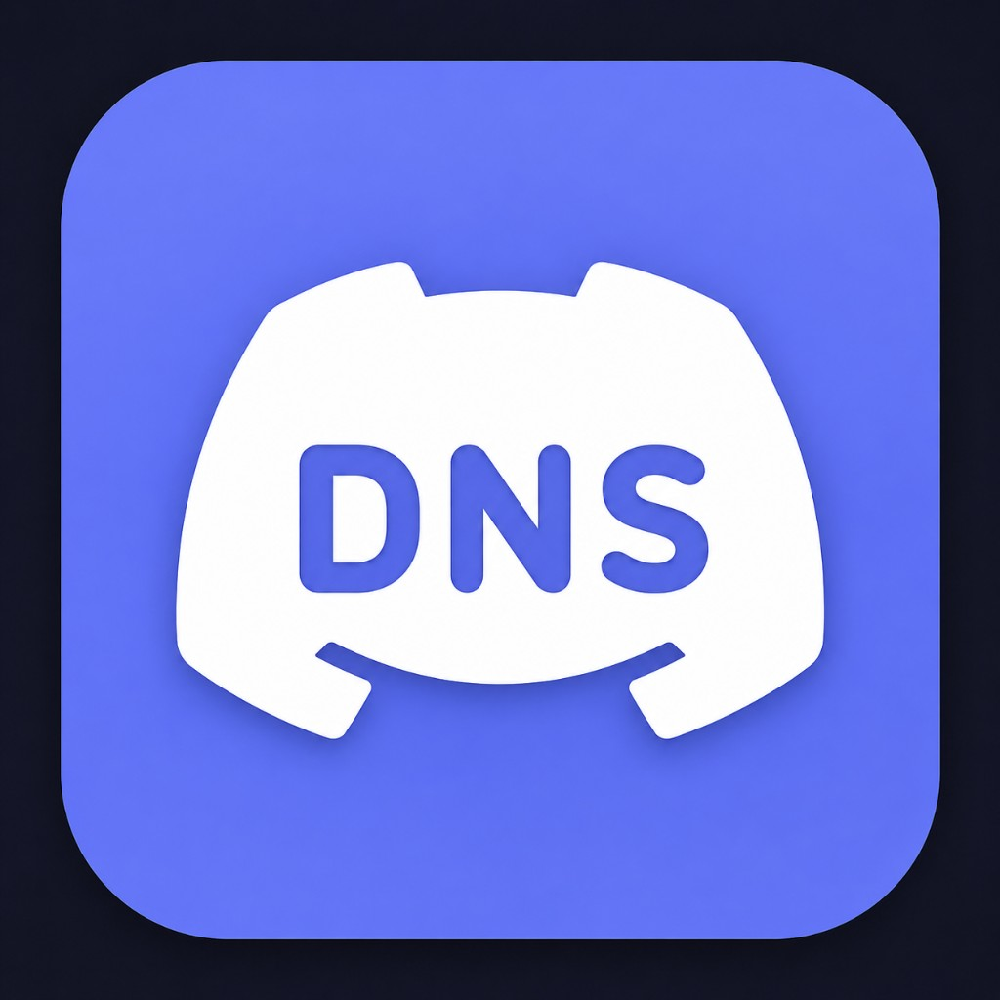

<div align="center">
  
  <h1>Discord DNS Switcher</h1>
  <p>A clean Windows utility that changes your DNS in one click — built to fix Discord connectivity issues caused by ISP DNS blocks.</p>

  
  
  
  
</div>

---

## What it does

Your ISP may block or throttle Discord by returning bad DNS results. This app lets you switch to a trusted public DNS (Google, Cloudflare, Quad9) in seconds — no registry editing, no command prompt needed.

It handles the **Windows 11 IPv6 override problem** automatically: if only IPv4 DNS is changed, Windows still uses the IPv6 DNS server (usually your ISP's) and the problem persists. This app sets both at once.

---

## Quick Start

1. Download `DNS_Switcher_Setup.exe` from the [Releases](../../releases) page
2. Run the installer — it bundles everything, no .NET install needed
3. **Right-click → Run as administrator** (DNS changes require elevation)
4. Pick a DNS preset, click **▶ Apply DNS**, done

---

## Features

| Feature | Details |
|---|---|
| **One-click presets** | Google, Cloudflare, and Quad9 with IPv4 + IPv6 |
| **Custom DNS** | Enter any primary / secondary address for both families |
| **Auto-detects adapters** | Finds active physical adapters, skips virtual/VPN ones |
| **IPv6 handling** | Sets both IPv4 and IPv6 DNS together to prevent override |
| **Disable IPv6** | Optional nuclear option if IPv6 itself is the problem |
| **Restore automatic** | Reset to DHCP with one click |
| **Discord test** | Tests DNS resolution, ping, and TCP connect to discord.com |
| **Detailed log** | Every PowerShell command, exit code, and result is shown |
| **Self-contained** | Single `.exe`, no .NET runtime install required |

---

## DNS Providers

### Google `8.8.8.8`
| | Primary | Secondary |
|---|---|---|
| IPv4 | `8.8.8.8` | `8.8.4.4` |
| IPv6 | `2001:4860:4860::8888` | `2001:4860:4860::8844` |

Fast and globally distributed. The safe default.

### Cloudflare `1.1.1.1`
| | Primary | Secondary |
|---|---|---|
| IPv4 | `1.1.1.1` | `1.0.0.1` |
| IPv6 | `2606:4700:4700::1111` | `2606:4700:4700::1001` |

Ranked the fastest DNS resolver worldwide. Privacy-first (no personal data logging).

### Quad9 `9.9.9.9`
| | Primary | Secondary |
|---|---|---|
| IPv4 | `9.9.9.9` | `149.112.112.112` |
| IPv6 | `2620:fe::fe` | `2620:fe::9` |

Blocks malware, ransomware, and phishing domains automatically.

---

## Why IPv6 DNS matters on Windows 11

Windows prefers IPv6 over IPv4 when both are available. If you change only the IPv4 DNS to `8.8.8.8` but leave IPv6 DNS pointing at your ISP, Windows continues using the ISP DNS for most lookups.

**Symptoms:**
- Discord still fails after switching DNS
- `nslookup discord.com` returns your ISP's blocked address
- Other apps on the same network work fine

**Solution:** Always leave "Set IPv6 DNS too" checked (it is on by default).

---

## Building from source

```powershell
# Clone
git clone https://github.com/bt907/Discord-Dns-Changer.git
cd Discord-Dns-Changer

# Build
dotnet build -c Release

# Publish self-contained single-file exe
dotnet publish -c Release -r win-x64 --self-contained true -p:PublishSingleFile=true
```

Requires [.NET 8 SDK](https://dotnet.microsoft.com/download/dotnet/8.0).

---

## Project layout

```
Discord-Dns-Changer/
├── Assets/
│   ├── icon.png              – App logo
│   └── icon.ico              – Taskbar / exe icon
├── Models/
│   ├── NetworkAdapterInfo.cs – Adapter data model
│   └── DnsProvider.cs        – DNS preset definitions
├── Services/
│   ├── AdminService.cs       – Admin check + UAC elevation
│   ├── PowerShellService.cs  – Async PS runner with CLIXML cleaner
│   ├── AdapterService.cs     – Discovers adapters + reads DNS
│   ├── DnsService.cs         – Apply / restore / test
│   └── DiscordService.cs     – Discord install detection
├── installer/
│   └── DNS_Switcher_Setup.iss – Inno Setup script
├── MainWindow.xaml            – UI layout (WPF, dark theme)
├── MainWindow.xaml.cs         – UI event handlers
├── DNS_Switcher.csproj        – .NET 8 project file
└── app.manifest               – UAC + DPI awareness manifest
```

---

## Troubleshooting

**"No active adapters found"**  
At least one physical adapter must be connected and enabled. Virtual adapters (Hyper-V, Docker, VPN, Bluetooth PAN) are intentionally filtered out.

**"Restart as Administrator" button appears**  
DNS changes require elevation. Click the button and approve the UAC prompt — the app will relaunch with admin rights automatically.

**IPv6 DNS command fails**  
Some older adapters or Windows builds don't expose an IPv6 interface. This is a warning, not a fatal error — the IPv4 DNS change still applies.

**Discord test shows "TCP 443 refused"**  
Your network (firewall, ISP, router) is blocking port 443 to Discord's servers. Changing DNS alone won't fix a port block — try a VPN.

**DNS test shows ISP address after applying**  
Windows DNS cache can take a few seconds to expire. The app flushes the cache automatically after applying. Wait 5 seconds and test again.

---

## License

MIT — do whatever you want with it.
